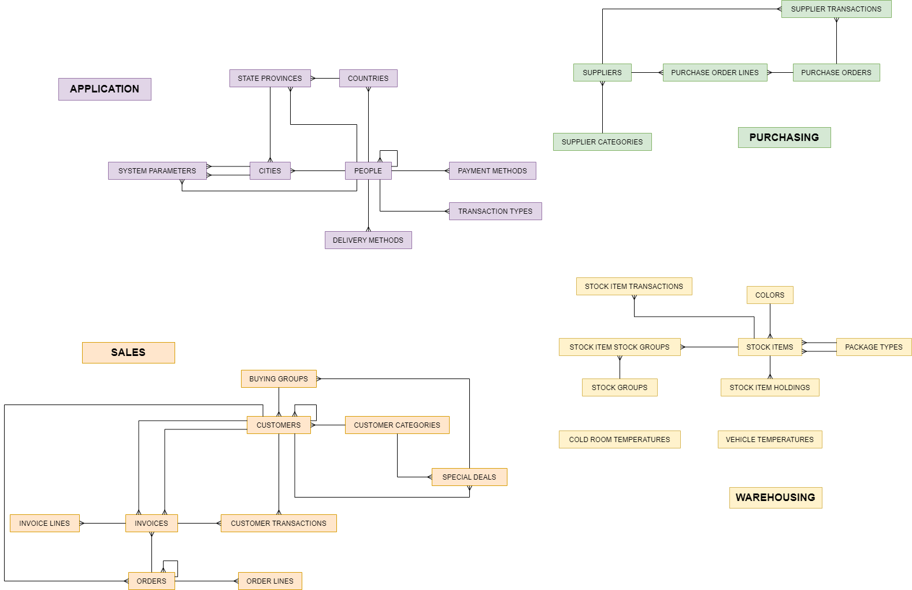

# Wide World Importers (WWI) Project

TEST: 

In this project, we will use SQL (DDL, DML and DQL) in order to analyze the WideWorldImporter database.
Wide World Importers (WWI) is a fictitious wholesale novelty goods importer and distributor operating from the San Francisco bay area.

We will proceed in 2 steps:
- Sales & Customers analysis
- Suppliers & Stock Analysis

Link to the Data Dictionary: [here](https://dataedo.com/samples/html/WideWorldImporters/doc/WideWorldImporters_5/home.html)

**WWI Schema:**
 

## Sales & Customer Analysis

### Sales Analysis

- Creation of a new table called SalesAnalysis in order to analyze TotalSales by country, region, city and orderdate, and relevant constraints

- Population of this new table with existing data

- Query of total sales, order count and average order value per customer category

- Query top 10 products with highest sales amount

- Calculate the monthly sales amount per customer category

### Customer Analysis

- Creation of a new table called CustomerAnalysis in order to analyze several metrics (TotalSales, NumberOfOrders, AverageOrderValue) according to different dimensions (CustomerName, Country, Region, City)

- Creation of a stored procedure named usp_InsertCustomerAnalysis to insert data into new the table, and Execution of this procedure to populate the new table

- Creation of a stored procedure named usp_GetCustomerSegmentation to classify customers (Standard / Premium) as per a certain threshold parameter

- Execution of this procedure with a threshold of 100,000 USD

- Query the average order value per customer category

- Query the order count and total sales (LineProfit) for each city

## Suppliers & Stock Analysis

### Stock Analysis

- Creation of a new table called StockItemAvailability to check item availability on a specific date, and relevant constraints

- Creation of a view called LowStockItems to show all stock items where QuantityOnHand is less than ReorderLevel

- Creation of a stored procedure called AddStockItemTransaction to add stock item to StockItemTransactions table

- Creation of a trigger to update LastEditedWhen automatically when a new transaction is added to the table

- Query info on stock items that have a RecommendedRetailPrice > 50

- Query info on stock items that belong to 'Clothing'

- Query total quantity of transactions for each StockItemID

- Query top 5 stock items with highest QuantityOnHand

- Query info on stock items that have RecommendedRetailPrice > avg RecommendedRetailPrice for all items

- Query info on stock items that have RecommendedRetailPrice > 50 and belong to 'Clothing'

### Suppliers Analysis

- Modification of the Suppliers table: add a SupplierEmail column

- Creation of a view called StockItemsWithSuppliers that display stock and supplier information

- Add a constraint to PurchaseOrderLines to have OrderedOuters > 0

- Creation of a stored procedure called UpdateStockItemPrice to update an item price

- Creation of a trigger to add a record to StockItemTransactions when QuantityOnHand column is updated

- Query total quantity on hand of stock items with unit price > $10, then with unit price < $10

- Query the top 10 suppliers with highest order amount

